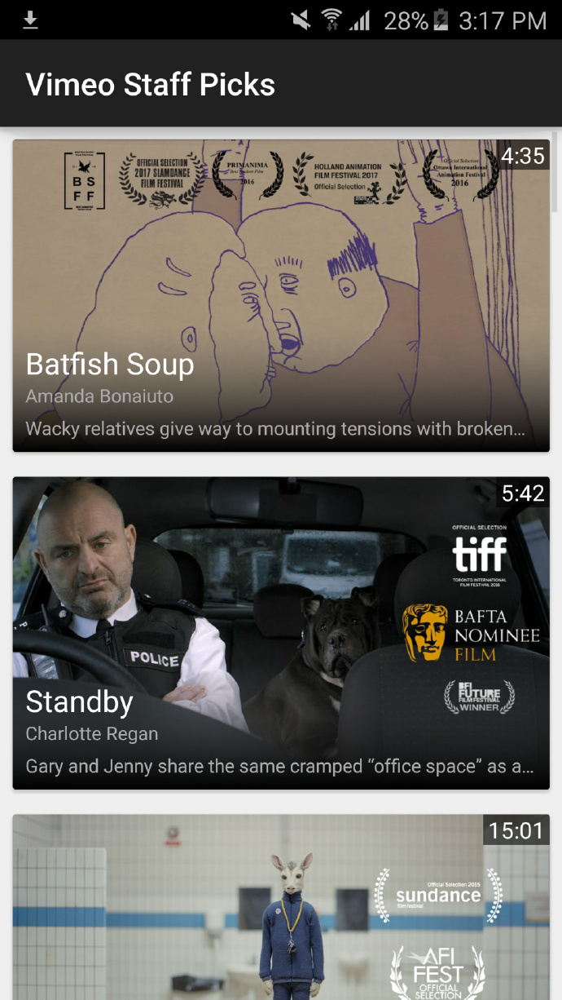
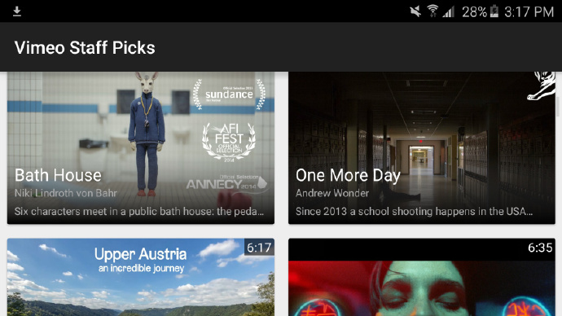

## Vimeo Mobile & TV Apps Group
### Android Coding Exercise

Interviewee: Chang (Hilda) He

Date: March 14 2017

###Project Requirements:

* A bug-free app that displays the Staff Picks list
* Architectural clarity
* Software design that can scale
* Clear, functional, and responsive UI

###Sumary:

According to the requirements, I implemented a bug-free app that display the *Staff Picks List* with clear architectural and design that can scale. I changed the UI design based off my opinions and added some new functions to the original code base.

Below are the looks of this app on my Samsung S6 in both portrait mode and landscape mode.

portrait mode

landscape mode

###Explainations:

#####UI-wise:

* I used <mark>**recycle view**</mark> instead of Listview to implement this UI. Different screen mode will result in either list or grid view.
* Using <mark>**card view**</mark> gives it a little better look from my perspective.

#####Function-wise:

* I added a <mark>**new function**</mark> to retrieve more videos when user scroll down on the page. So it will fecth the next serie of videos from the server and show them below the orinal videos before user reach the end of the page.
* I added a **small alert** (Toast) poping up if their device is not connected to wifi.

#####Code structure-wise:

* I made a <mark>**DataRequester**</mark> class for activity to call API in order to retrieve data. It includes a **callback interface** to be implemented by each of the calling activity. So this DataRequester can be re-usable and easily scaled.
* I made a <mark>**VideoModel**</mark> class as a model class to contain video data. It contains JSON parser to help parse the data we need. This class can also be re-usable by other activities/controllers who needs video data.

###Third party library:
* I only used one 3-rd party library, which is ***Picasso***. It helps with image loading and caching. 
* I added two other *Android Support Libraries* to help with implementation of recycle view and card view.

###Someting to say:
* Fetching 25 videos a time takes fairly long for user to wait, especially the first time we open the app. So, I change the fetch to be 12 videos per time. However it still requiires fairly long. So for further improvment, I would like to add a waiting animation before the app successfully fetch and display videos for the first time. Or we can change the number of per_page to an even smaller digit in order to decrease the waiting time. 